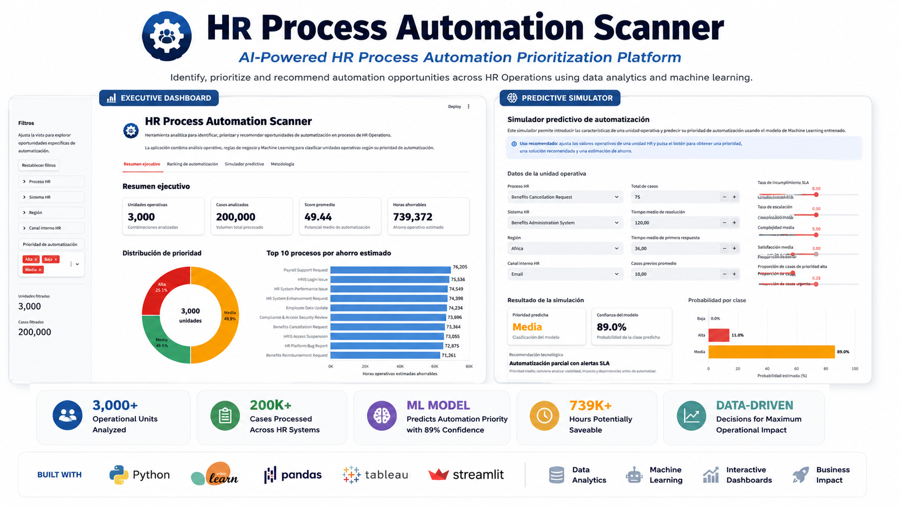
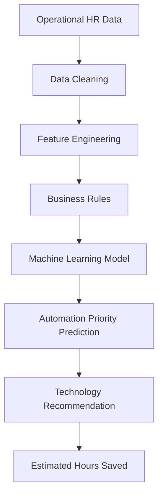
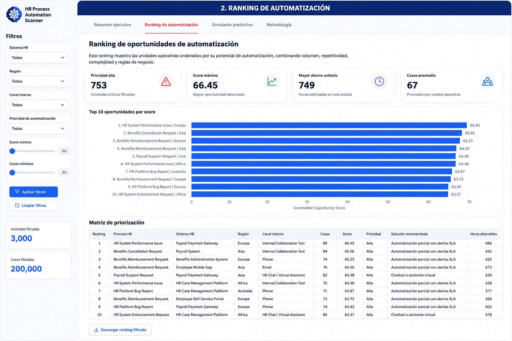
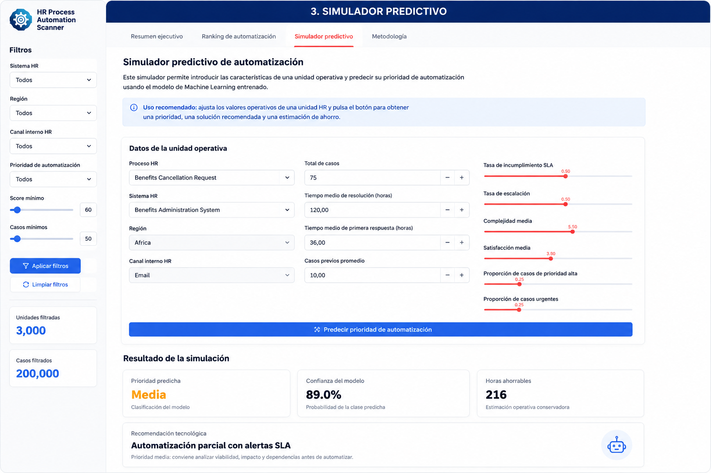
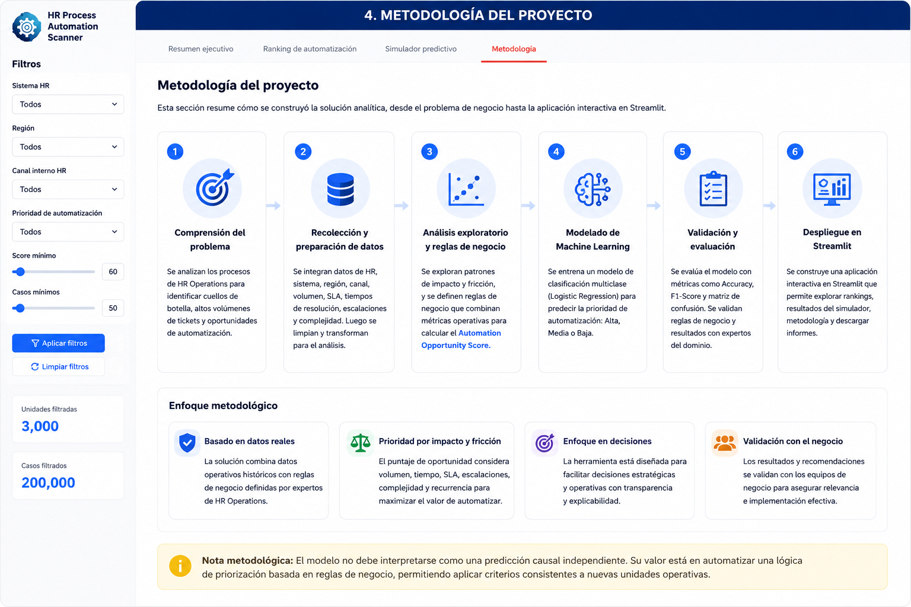

# HR Process Automation Scanner


### End-to-End Data Analytics & Machine Learning Project



This project identifies, prioritizes and recommends HR processes with the highest automation potential using data analytics, business rules, machine learning, Tableau and Streamlit.

It transforms operational HR ticket data into a decision-support tool that helps teams understand where automation can generate the highest operational impact.

## Live Demo

Try the application online:

Streamlit App:** Coming soon
---

## Project Overview

HR departments manage thousands of operational requests every day, but not every process should be automated first.

This project combines exploratory data analysis, business rules, feature engineering and machine learning to identify where automation can generate the greatest operational impact.

The final solution includes:

- Interactive Streamlit application
- Machine Learning prediction model
- Business automation scoring
- Executive Tableau dashboard
- Operational decision support

---

## Tech Stack

| Category | Technologies |
|----------|--------------|
| Programming | Python |
| Data Analysis | Pandas, NumPy |
| Machine Learning | Scikit-learn |
| Visualization | Tableau |
| Web App | Streamlit |
| Data Processing | Feature Engineering |
| Business | HR Analytics · Process Automation · Decision Support |

---

# Model Performance

| Metric | Value |
|---------|------:|
| Accuracy | **96.83%** |
| Macro F1 Score | **96.85%** |
| Algorithm | Logistic Regression |
| Classes | Alta · Media · Baja |
| Task | Multiclass Classification |

The model predicts the automation priority of HR operational units with high overall performance, making it suitable for decision-support scenarios.

---

## Key Features

- Prioritizes HR processes based on automation potential.
- Predicts automation priority using Machine Learning.
- Estimates operational hours that can be saved.
- Interactive filtering by HR Process, System, Region and Channel.
- Business recommendation engine.
- Executive dashboard for decision makers.

---

## Project Structure

```text
HR-Process-Automation-Scanner
│
├── app/
│   └── Streamlit application
│
├── data/
│   └── Dataset
│
├── images/
│   └── Dashboard screenshots
│
├── models/
│   └── Trained Machine Learning model
│
├── notebooks/
│   ├── 01_Data_Understanding.ipynb
│   ├── 02_Exploratory_Analysis.ipynb
│   └── 03_Machine_Learning.ipynb
│
├── reports/
│   └── Tableau dashboard
│
├── src/
│   └── Helper functions
│
├── requirements.txt
└── README.md
```

---

## Machine Learning Pipeline



---

# Application Showcase

## Executive Dashboard

The executive dashboard provides an overview of automation opportunities across HR Operations.

- Operational KPIs
- Automation opportunity score
- Estimated hours saved
- Priority distribution
- Top automation candidates

---
## Full Project Showcase

### 1. Executive Dashboard

The executive dashboard provides a high-level overview of automation opportunities across HR Operations, including KPIs, automation scores, priority distribution and estimated operational impact.


---

### 2. Automation Opportunity Ranking

This interactive ranking identifies the operational units with the highest automation potential based on business rules and machine learning predictions.



---

### 3. Predictive Simulator

Users can simulate new HR operational scenarios and instantly receive the predicted automation priority, confidence score, technology recommendation and estimated hours saved.



---

### 4. Project Methodology

This section explains the complete analytical workflow used to build the solution, from business understanding and feature engineering to machine learning and deployment.



